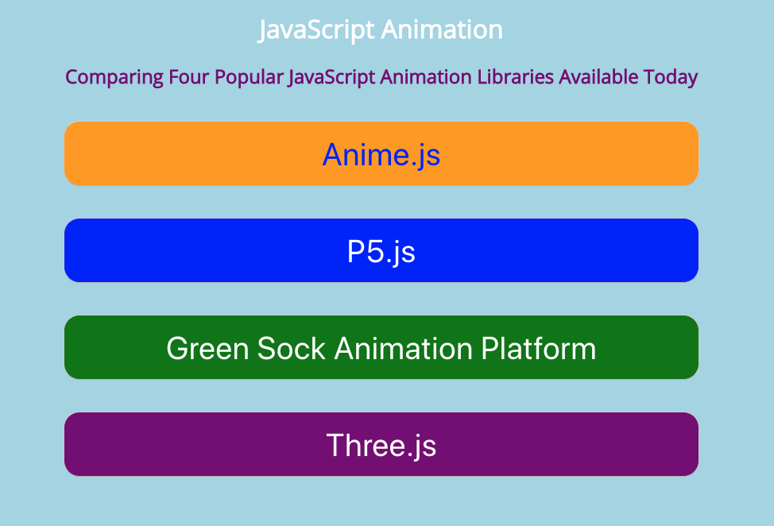

# coompare-javascript-animation-libraries



This project is a comparison of 4 JavaScript animation libraries to include:
1. [Anime.js](https://animejs.com/)
2. [P5.js](https://p5js.org/)
3. [Three.js](https://threejs.org/)
4. [Green Sock Animation Platform(GSAP)](https://greensock.com/get-started/)

This project is a React project that has examples from each of the libraries:
- Anime.js `/src/components/Anime.js`
- GSAP.js `/src/components/GSAP.js`
- P5.js `/src/components/P5.js`
- Three.js `/src/components/Three.js`

To see videos of the components running please review the `/videos` folder.

To run this project locally do:
```bash
npm run start
```

To build this project (bundle):
```bash
npm run build
```

